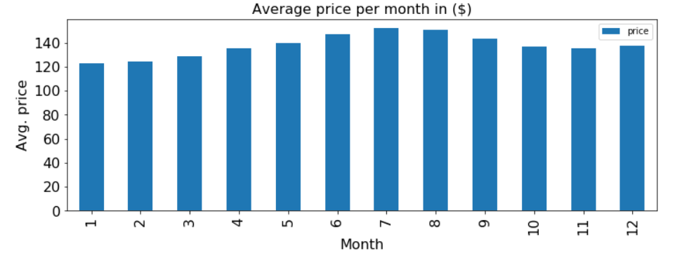
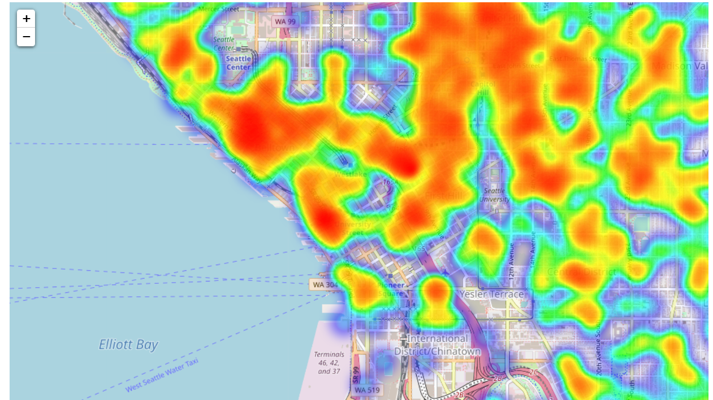

### Exploratory data analysis of Airbnb Seattle dataset
#### Dependencies
To run the notebook, the following python packages are required: 
   &nbsp;&nbsp;&nbsp; numpy  
   &nbsp;&nbsp;&nbsp;     matplotlib  
   &nbsp;&nbsp;&nbsp;     pandas  
   &nbsp;&nbsp;&nbsp;    folium  
   &nbsp;&nbsp;&nbsp;     sklearn  
This notebook goes through data preparation, preparation and visualizaitons to answer the following questions:  
The dataset can be downloaded from [here](https://www.kaggle.com/airbnb/seattle/data)

##### &nbsp;&nbsp;&nbsp; 1. How the listing prices are distributed?
##### &nbsp;&nbsp;&nbsp; 2. Which months are priciest ?
##### &nbsp;&nbsp;&nbsp; 3. Which months are the busiest to visit Seattle? Does busy month also means expensive?
##### &nbsp;&nbsp;&nbsp; 4. What is the distribution of the listings in the city borders? are they evenly distribued or concentrated in few neighbourhoods?
##### &nbsp;&nbsp;&nbsp; 5. What can be said aboud the vibe of the neighbourhoods based on reviews?
In the notebook, the questions are analysed step-by-step to arrive at data-driven conclusions.
To render some plots (maps) on the notebook, you can use [nbviewer](http://nbviewer.org/). 
### Summary of Findings:
1. The mass of weekly price listings is in the range of $100 - $1000 but the distribution has a long right tail (maximum upto $6300)  
2. On average, July is the most expensive month followed closely by August and June.  

3. Based on the amount of reviews received, it seems that Seattle is visited most in August.  
4. Most of the listings are concetrated in just few neighbourhoods of Seattle (e.g. Broadway, Belltown ...).  
5. Based on the frequent words appearing in reviews/comments, some information about the feel/vibe of each neighbourhood can be infered.  

### Acknowledgement
&nbsp;&nbsp; [1]. Inside Airbnb initiative, link [here](http://insideairbnb.com/about.html).  
&nbsp;&nbsp; [2]. Visualization of text data (a blog post from towards data science), link [here](https://towardsdatascience.com/a-complete-exploratory-data-analysis-and-visualization-for-text-data-29fb1b96fb6a).  
### Medium blog post summarizing the results is available [here](https://medium.com/@daazene/airbnb-seattle-dataset-basic-exploratory-data-analysis-b2615b2a44ef). 
